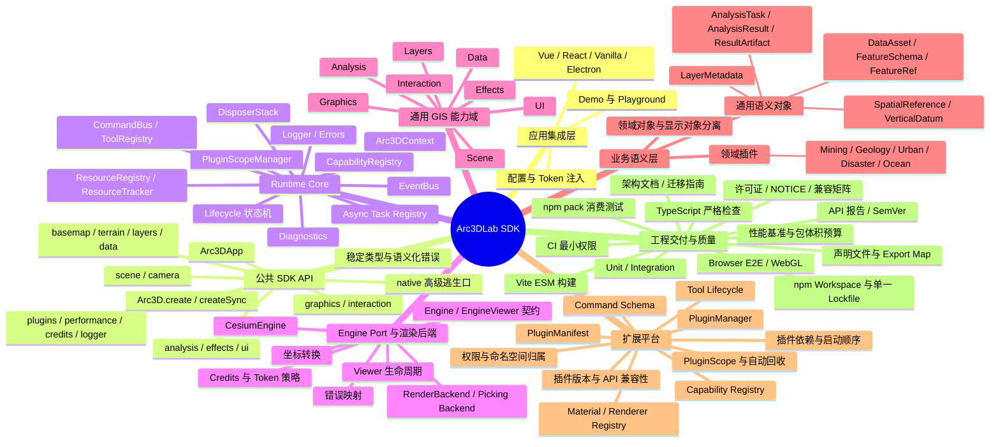
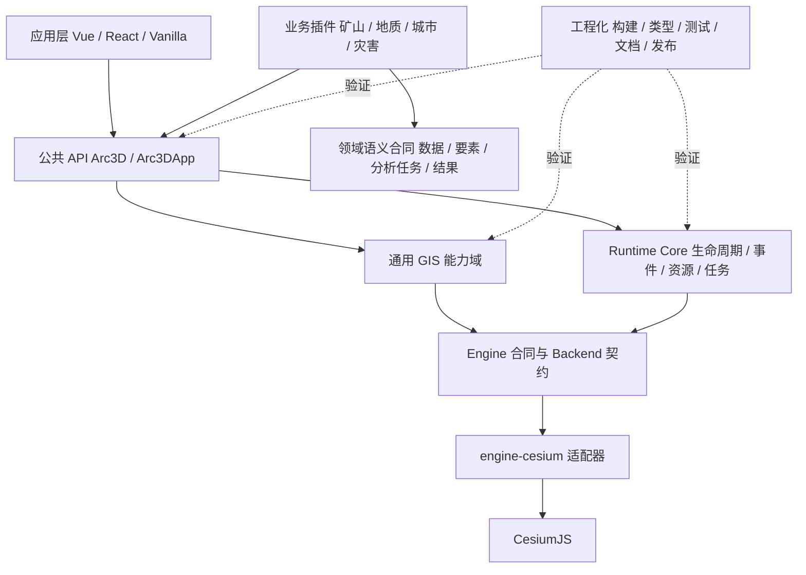
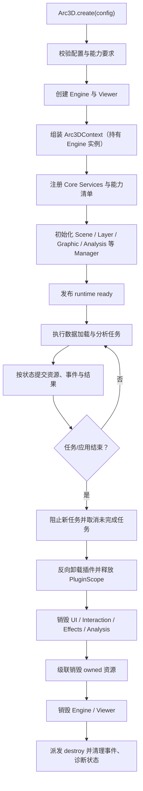

# Arc3DLab SDK 整体设计框架

Feature Name: arc3dlab-sdk-runtime
Updated: 2026-10-09
Status: Living Document（持续迭代的约束性设计框架）
References: `docs/architecture/`、`Arc3DLab_SDK_架构组成设计脑图-2.md`、`现有SDK整改和优化清单-1.md`

## 0. 文档定位与使用方式

本文件是 Arc3DLab SDK 的顶层设计框架，约束后续所有迭代。它把产品定位、架构边界、公共合同、业务语义和验收门禁固化成可执行的约束集合。

- `docs/architecture/`：面向开发者的模块级设计正文，按模块拆解。
- 本文件：跨模块决策与硬约束，任何模块设计冲突时以本文件为准。
- `现有SDK整改和优化清单-1.md`：外部审阅结论（问题证据）。
- `SDK整改与优化清单.md`（本次生成）：可跟踪的整改清单，记录每项的状态与验收。

迭代流程：

1. 先改本文件与对应模块文档，再改代码。
2. 每一项稳定合同必须映射到测试 ID。
3. 文档中的合同状态使用 `Implemented / Partial / Planned` 标注。
4. 架构决策变更追加到 `docs/architecture/CHANGELOG.md`。

## 1. 产品定位与架构战略

### 1.1 定位

Arc3DLab 是面向三维 WebGIS 应用的模块化场景运行时 SDK。

```text
Arc3DLab
A Modular 3D WebGIS Runtime
Built on CesiumJS
```

### 1.2 引擎战略（明确决策）

第一阶段采用 **Cesium-first** 战略，并在代码合同中如实表达：

- `Engine` 是 SDK 内部运行时适配合同，负责 Viewer 生命周期、能力上报、错误映射与销毁。
- 功能域（scene / layers / graphics / interaction / analysis / effects）当前直接依赖 Cesium API，这属于 Cesium-first 的已知事实。
- 对外文档与类型不再承诺“即插即用多引擎”。
- 若要升级为多引擎战略，必须满足第 4 节的“多引擎升级前置条件”，并先通过 Fake Engine 端到端验收。

多引擎升级前置条件（Planned）：

1. `Arc3D.create()` 支持 `EngineFactory` 注入，Context 持有完整 `Engine` 实例。
2. 定义相机、坐标、渲染、拾取、资源后端、错误映射六类端口。
3. 功能域只依赖端口合同，Cesium API 收敛在 `engine-cesium`。
4. Fake Engine 能完成 `create → graphics/layers/interaction → destroy` 全流程且不导入 Cesium。
5. 能力不支持时抛出 `UNSUPPORTED_CAPABILITY`。

### 1.3 交付形态

- 内部模块边界优先：源码位于 `packages/*`。
- 对外发布单一包 `arc3dlab`，子路径 `arc3dlab/engine-cesium`。
- 主入口 `Arc3D.create()` / `Arc3D.createSync()`；兼容入口 `Viewer`（Legacy Adapter）。

## 2. 总体架构



## 3. 依赖方向与硬规则



硬规则：

1. `core` 只依赖平台基础能力与抽象契约，不导入 `cesium`、Vue、React 或业务插件。
2. `engine-cesium` 是唯一的 Cesium 适配边界；功能域的 Cesium 调用收敛在能力域实现内部，并统一通过 `getCesiumViewer` 取用底层 Viewer。
3. 产品定位与实现承诺保持一致：Cesium-first 阶段，文档与类型宣称“基于 CesiumJS”，多引擎能力标注为 Planned。
4. 业务插件只依赖公共 SDK 合同与领域合同，不直接修改内部 Registry、Viewer 全局状态或未承诺稳定的私有对象。
5. 所有注册型扩展（命令、工具、材质、渲染器、事件订阅、资源）必须能按插件作用域统一回滚与销毁。
6. 显示对象、领域对象、输入数据与分析结果分离。`Graphic` 是渲染/交互对象，业务实体通过稳定 ID 或 `FeatureRef` 引用。
7. 异步 API 返回 `Promise<T>`；创建、销毁、取消路径必须显式处理竞态。
8. 任何稳定公共合同必须有自动化测试。

## 4. 运行时主流程



### 4.1 ready 语义（Implemented）

`ready` 表示 Runtime facade 已完成组装，公共 API 可调用。它不表示默认底图、地形或业务数据已经加载完成。

- `runtimeReady`：`ready` 事件与 `app` 可用。
- `sceneReady`（Planned）：首屏资源（默认底图、初始地形、业务数据）就绪信号。
- 每个异步资源使用独立状态：`idle / loading / ready / partial / failed / cancelled / disposed`。

### 4.2 生命周期状态机（Implemented）

```text
created -> initializing -> ready -> destroying -> destroyed
```

- `destroying / destroyed` 后调用公共 API 抛出 `APP_DESTROYED`。
- `destroy()` 幂等；重复调用返回同一 Promise。
- 销毁顺序：卸载插件 → disposer 栈 → UI/交互 → 特效/分析 → 资源级联 → Engine/Viewer → 事件清理。

## 5. 关键公共合同

### 5.1 Runtime Context（Implemented）

```ts
interface Arc3DContext {
  config: Arc3DConfig
  engine: EngineContext      // { type, viewer, native, engine? }
  engineAdapter: Engine      // 完整 Engine 实例，供能力/错误/销毁
  registry: ResourceRegistry
  tracker: ResourceTracker
  events: EventBus
  lifecycle: LifecycleManager
  logger: Logger
  capabilities: CapabilityRegistry
  commands: CommandBus
  tools: ToolRegistry
  disposers: DisposerStack
  scopes: PluginScopeManager
}
```

### 5.2 Engine 适配合同

```ts
interface Engine {
  readonly type: string
  createViewer(options: EngineViewerOptions): EngineViewer
  hasCapability(name: string): boolean
  mapError(error: unknown): { message: string; code?: string }
  destroy(): void
}
```

- Context 必须持有完整 Engine 实例，销毁统一走 Engine。
- 能力清单由 Engine 依据真实后端得出（见 5.3）。

### 5.3 能力合同（Implemented）

能力分为两类，注册时由实际 Engine/Backend 回报可用状态：

- SDK 提供能力：分析、测量等纯运行时能力，SDK 代码存在即可用。
- 后端能力：`engine:*`、`render:*`、`graphic:model`、`effects:postprocess` 等，取决于 Engine。

规则：

- `CapabilityRegistry.require()` 在能力缺失时抛出 `UNSUPPORTED_CAPABILITY`；空 Registry 直接放行的兼容分支已移除。
- `has()` 返回 `available === true`。
- 同名能力由不同 provider 注册时抛出 `DUPLICATE_RESOURCE`。
- 同一 provider 可更新自身能力记录。

### 5.4 插件合同（Implemented / Partial）

```ts
interface Arc3DPlugin<TApp = unknown> {
  name: string
  version?: string
  requiresCapabilities?: string[]   // 能力依赖
  dependsOnPlugins?: string[]       // 插件依赖
  install(app: TApp, context: Arc3DContext, scope: PluginScope): void | Promise<void>
  uninstall?(app: TApp, context: Arc3DContext): void | Promise<void>
}
```

- 插件拥有状态机：`installing / installed / uninstalling / failed / disposed`。
- 每个插件绑定一个 `PluginScope`；插件注册的命令、工具、能力、材质、事件订阅、disposer、资源句柄都登记到作用域。
- 卸载采用 `try / finally`：无论 `uninstall` 是否抛错，作用域撤销与扩展清理始终执行。
- 命名空间归属由 `PluginScope` 注入不可伪造的 owner ID，注册者传入的 `plugin` 字段不作为唯一依据。
- `dependsOnPlugins` 决定安装拓扑顺序与卸载反向顺序；被依赖插件禁止直接卸载。

### 5.5 Command 与 Tool 合同（Implemented / Partial）

- Command Schema 支持 `string / number / boolean / object / array / enum`，以及 `required / finite / min / max / nested / additionalProperties` 策略。
- 错误携带字段路径、命令 ID 与稳定错误码。
- 所有命令支持可选 `AbortSignal / timeout / progress`。
- Tool 使用明确状态机：`deactivating → activating → active`；切换失败进入明确的无活动状态或回滚旧工具。
- 注销活动工具先执行可观测的 `deactivate()`。

### 5.6 资源合同（Implemented）

```ts
interface ResourceHandle<TNative = unknown> {
  id: string
  type: string
  native: TNative
  visible: boolean
  owned: boolean
  owner?: string      // 归属插件/模块
  destroy(): void
}
```

- `owned=true`：SDK 负责销毁；`owned=false`：借用对象，销毁只取消注册。
- 复合资源（Polygon fill + outline）对外是单一 Graphic，内部由 ResourceTracker 统一回收。

## 6. 通用业务语义层（Planned / Partial）

先固化通用 WebGIS 语义，再由领域插件扩展行业对象。

### 6.1 空间与数据语义

- `SpatialReference`：水平 CRS、轴顺序、角度单位、投影单位。
- `VerticalDatum`：区分椭球高、正高、地形采样高、设计面高。
- `DataAsset`：ID、格式、URI、版本、数据范围、时间范围、空间参考、字段模式、版权、校验值、来源。
- `FeatureSchema / AttributeField`：字段名、类型、单位、枚举、必填、显示名、派生标识。
- `FeatureRef`：业务对象稳定 ID、数据资产 ID、版本与来源。
- `LayerMetadata`：数据引用、图层类型、样式、层级、分组、可见性、加载状态、错误、版权。

默认简写约定：现有 `LngLat / LngLatHeight` 明确为 WGS84 经纬度、度、椭球高。

### 6.2 任务与结果语义

- `AnalysisTask<TInput, TResult>`：任务 ID、算法类型/版本、输入引用、参数、状态、起止时间、进度、取消、资源上限。
- `AnalysisResult<TResult>`：单位、CRS、高程基准、结果范围、警告、误差/可信度、输入快照、算法版本、来源、产物引用。
- `ResultArtifact`：体积模型、剖面线、视域面、采样网格、报告文件等。
- 采样类结果状态：`sampled / fallback / unavailable / cancelled`。

### 6.3 插件合同与领域模型分离

通用 SDK 负责生命周期、数据与空间合同、渲染、交互、分析任务、错误、注册、权限与资源回收。`mining / geology / urban / disaster / ocean` 插件负责行业对象、数据适配、业务工作流、专业算法与 UI。

## 7. 模块清单与演进方向

| 路径 | 现有职责 | 目标演进方向 |
|---|---|---|
| `packages/core` | Context、Lifecycle、EventBus、Resource、Capability、Command、Tool | 补配置校验、任务登记、PluginScope、诊断/观测合同 |
| `packages/engine-cesium` | Cesium Viewer、坐标、Credits、Ion Token | 唯一 Cesium 适配边界；Token 串行化；暴露可注入 Engine 实例 |
| `packages/scene` | 相机、场景模式、时钟、视口、环境 | 补事件派发与可测试相机/渲染合同 |
| `packages/layers` | 底图、影像、地形、Tileset | 抽通用 LayerGroup / 加载状态 / 元数据目录 |
| `packages/data` | Provider、GeoJSON、KML、CZML | 增加 DataAsset、数据源元信息、坐标/时间/授权与血缘 |
| `packages/graphics` | 点线面模型、Entity/Primitive、RenderPolicy | 拆 Manager 与 Backend；明确属性模式与批量合同 |
| `packages/interaction` | 拾取、选择、鼠标事件 | 补绘制/编辑工具合同与一致销毁语义 |
| `packages/analysis` | 测量、地形、视域、查询、剖切、土方、调度 | 统一 AnalysisTask/Result；真实 Worker 与主线程调度分离 |
| `packages/effects` | 材质 Registry、后处理 | 修正 Bloom/Blur 语义；注册内容可归属插件并自动卸载 |
| `packages/ui` | Tooltip DOM | 补 Popup/Control/Panel 约定，监听与节点纳入资源作用域 |
| `packages/sdk` | Arc3D、Arc3DApp、插件机制 | 拆 Facade 与 Service Composition；示例领域插件/Harness 移出产品源码 |
| `packages/legacy` | `Viewer` 兼容适配器 | 只做明确、可测的映射；保持弃用策略与迁移表 |
| `src/index.ts` | 根包再导出 | 明确公共 API 白名单，导出 Options/Result/Event/Error/Plugin 类型 |
| `tests` / `.github` / `scripts` | 单测、集成测试、CI、发布门禁 | 加浏览器 E2E、并发与销毁竞态、覆盖率与 bundle size 预算 |

## 8. 工程交付与质量门禁

- 单一包管理器与唯一 lockfile（npm）。
- `typecheck`（`tsc --noEmit`）、`test`、`lint:deps`、`lint:exports`、`lint:license`、`format:check` 覆盖 TypeScript 源码。
- `build` 产出 ESM 与类型声明；`test:pack` 验证 npm tarball 消费。
- Browser E2E（Playwright）覆盖创建、加载、绘制、拾取、后处理、销毁与重建。
- API 报告与 SemVer 变更管理；兼容矩阵记录 Cesium peer 支持范围。
- CI 最小权限 `permissions: contents: read`。
- 许可证 GPL-2.0-only 与 `NOTICE.md` 一致。

## 9. 约束到验收的映射

| 约束 | 对应整改项 | 验收方式 |
|---|---|---|
| Engine 实例由 Context 持有 | P0-01 | 单元测试断言 `context.engineAdapter` 与销毁路径 |
| 能力由 Engine 回报 | P0-03 | Fake Engine 缺能力时 `has=false`、`require` 抛出 |
| Ion Token 串行化 | P0-02 | 并发 token 交错测试与全局值恢复断言 |
| 插件卸载必达清理 | P0-04 | uninstall/tool/resource 抛错后清理完成 |
| Tool 状态机 | P1-02 | 激活/停用失败与活动工具一致性测试 |
| 插件依赖与归属 | P1-03 | 依赖缺失/命名空间冒充/级联卸载测试 |
| Command Schema | P1-04 | NaN/Infinity/null/枚举/额外字段测试 |
| ready 语义 | P1-09 | 默认底图成功/失败/关闭三路径 |
| Bloom 语义 | P1-10 | 真实 Bloom、停用、重复启用、destroy 无残留 |
| 公共 API 白名单 | P1-11 | consumer 类型编译测试 |
| 诊断可观测性 | P1-13 | 只读快照与销毁后零残留断言 |
| 浏览器 E2E | P1-08 | CI 浏览器用例 |

## 10. Correctness Properties

- destroy 后公共 API 抛出 `APP_DESTROYED`。
- owned 资源在 destroy 时全部释放，借用资源只取消注册。
- Polygon outline 与 fill 生命周期绑定。
- `import arc3dlab` 不改写 Cesium 全局默认相机与 Ion Token。
- 插件卸载后其命令、工具、能力、材质、事件订阅、资源句柄、pending task 均为零。
- 能力缺失时抛出 `UNSUPPORTED_CAPABILITY`，且不产生副作用。
- 并发 Ion 授权任务互不串扰，任务结束后全局值恢复初始状态。

## 11. Error Handling

`Arc3DError` 携带 `code` 与 `cause`。稳定错误码：

`APP_DESTROYED / INVALID_CONTAINER / INVALID_ARGUMENT / RESOURCE_NOT_FOUND / DUPLICATE_RESOURCE / ENGINE_FAILURE / UNSUPPORTED_CAPABILITY / CANCELLED / AUTH_FAILED / NETWORK_FAILURE / INVALID_FORMAT`。

命令与参数校验失败返回稳定的 `Arc3DError`，错误信息包含字段路径与命令 ID。

## 12. Test Strategy

- 单元测试覆盖 core 纯逻辑、命令 Schema、资源与生命周期、插件作用域、分析算法。
- 集成测试覆盖 Fake Engine 的 `create → graphics/layers/interaction → destroy` 全流程。
- 并发与竞态测试覆盖 Ion Token、异步创建销毁、插件反复安装卸载。
- 浏览器 E2E 覆盖真实 WebGL 场景（Planned，见 P1-08）。
- 性能基准与包体积预算纳入 CI（Planned，见 P2-04 / P2-08）。

## 13. 参考

- `docs/architecture/` 全部模块设计文档
- `Arc3DLab_SDK_架构组成设计脑图-2.md`
- `现有SDK整改和优化清单-1.md`
- `SDK整改与优化清单.md`
