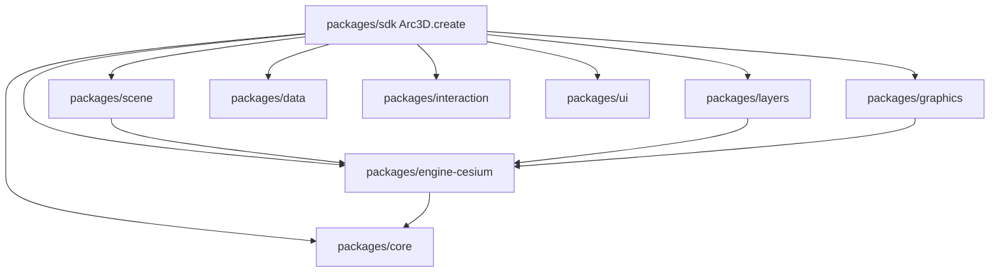

# Arc3DLab SDK Runtime

Feature Name: arc3dlab-sdk-runtime
Updated: 2026-10-08

## Description

按 `docs/architecture/` 将仓库重构为内部 packages 模块化运行时。对外发布单一 `arc3dlab` 包。主入口为 `Arc3D.create()`，Cesium 通过 Engine Adapter 接入。

完整设计正文以 `docs/architecture/` 为准，本文件记录实现决策。

## Architecture

## Components and Interfaces

- `LifecycleManager`：状态机与销毁守卫
- `EventBus`：泛型事件与 unsubscribe
- `ResourceRegistry` / `ResourceTracker`：统一注册与复合资源
- `CesiumEngine`：创建 Viewer、实例级 Token、Credits
- `GraphicManager` + `RenderPolicy`：auto/entity/primitive
- `LegacyViewer`：同步包装 Arc3DApp

## Data Models

见 `docs/architecture/02-runtime.md` 与 `06-graphics.md`。

## Correctness Properties

- destroy 后公共 API 抛出 `APP_DESTROYED`
- owned 资源在 destroy 时全部释放
- Polygon outline 与 fill 生命周期绑定
- import arc3dlab 不会改写 Cesium 全局默认相机

## Error Handling

`Arc3DError` 携带 `code` 与 `cause`。未知容器、重复 ID、已销毁调用均使用该类型。

## Test Strategy

Vitest 覆盖 core 纯逻辑；集成测试覆盖 Graphic 复合销毁与配置注入（无真实 Token）。

## References

[^1]: docs/architecture/README.md
[^2]: SDK设计方案-1.md
