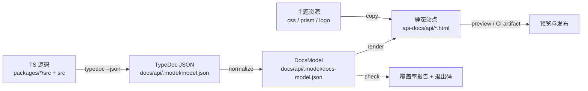

# Cesium 风格 API 文档站

Feature Name: cesium-style-api-docs
Updated: 2026-10-10
Status: Draft
References: `https://cesium.com/learn/cesiumjs/ref-doc/`、`.monkeycode/specs/2026-10-10-cesium-style-api-docs/requirements.md`、`docs/architecture/11-api.md`、`scripts/release-gate.mjs`

## 1. Description

本特性为 Arc3DLab SDK 建立一套自动生成的 API 参考文档站，其**框架与形式**严格对齐 CesiumJS 官方参考文档：同形的导航分类、`ClassName.html` 页面结构、`new X(...)` 构造签名与源码链接、`Name|Type|Description` 参数表、Throws、`dl.details`（Example / Demo / See / Default Value / Since / Deprecated）、Members / Methods 分区、`readonly` 与 `optional` 标记，以及 `.param-type` / `.type-signature` 等结构类名。

文档覆盖全部 13 个 `packages` 的公共导出，正文使用中文，标识符与类型保持英文。内容来源是源码中的 TSDoc 注释；文档系统同时提供覆盖率门禁，保证公共 API 注释完整。

关键决策（已确认）：

- 侧边栏按**包命名空间 + 类别**两级组织。
- **替换**现有 TypeDoc + Material 主题为自研 Cesium 风格生成器（仍用 TypeDoc 提取 API 模型）。
- 源码链接指向 GitHub 分支：`https://github.com/jianlei-wang/Arc3DLab_SDK/blob/<ref>/<path>#L<line>`，base 可配置。

## 2. Architecture

文档系统是一条单向流水线：源码 → API 模型 → 归一化文档模型 → 静态站点 → 校验。



流水线各阶段职责：

1. **提取（extract）**：TypeDoc 以 `resolve` 策略读取每个包的公共入口，输出 JSON 模型。TypeDoc 不生成 HTML。
2. **归一化（normalize）**：把 TypeDoc reflection 树映射为与渲染无关的 `DocsModel`（分类、命名空间、符号、成员、方法、参数、返回、异常、示例、源码）。
3. **渲染（render）**：从 `DocsModel` 生成 JSDoc-default 形式的 HTML，并解析类型交叉引用生成链接。
4. **资源（assets）**：复制 `jsdoc-default.css`、`prism.css`、`prism.js`、logo。
5. **校验（check）**：基于 `DocsModel` 计算注释覆盖率，产出 `report.json`，未达阈值非零退出。

## 3. Components and Interfaces

### 3.1 配置：`typedoc.json`（改造）

```jsonc
{
  "entryPoints": [
    "packages/core/src/index.ts",
    "packages/engine-cesium/src/index.ts",
    "packages/scene/src/index.ts",
    "packages/layers/src/index.ts",
    "packages/graphics/src/index.ts",
    "packages/data/src/index.ts",
    "packages/interaction/src/index.ts",
    "packages/analysis/src/index.ts",
    "packages/effects/src/index.ts",
    "packages/ui/src/index.ts",
    "packages/sdk/src/index.ts",
    "packages/legacy/src/index.ts",
    "src/index.ts"
  ],
  "entryPointStrategy": "resolve",
  "tsconfig": "./tsconfig.json",
  "excludePrivate": true,
  "excludeProtected": true,
  "excludeInternal": true,
  "readme": "none",
  "name": "Arc3DLab SDK API",
  "categorizeByGroup": true,
  "sort": ["kind", "alphabetical"],
  "validation": { "notExported": false }
}
```

要点：

- 每个包入口通过 `@module <PackageName>` 注释形成命名空间页。
- `excludeInternal` 与 `@internal` 配合，保证内部符号不进入文档。
- `entryPointStrategy: resolve` 让 13 个入口各自成为顶层模块。

### 3.2 生成器：`scripts/api-docs/`（新增，ESM `.mjs`）

| 文件 | 职责 |
|------|------|
| `build.mjs` | 编排：extract → normalize → render → assets → report；CLI 入口 |
| `extract.mjs` | 调用 TypeDoc 生成 `model.json`；返回项目 reflection |
| `normalize.mjs` | TypeDoc reflection → `DocsModel`；分类、排序、源码链接 |
| `render/index.mjs` | 生成 `index.html`、命名空间页、符号页、`global.html` |
| `render/symbol.mjs` | 类/接口/类型/函数页面渲染（构造、Members、Methods） |
| `render/type.mjs` | 类型表达式渲染 + 交叉链接（联合、数组、字面量、引用） |
| `render/comment.mjs` | TSDoc 摘要/remarks/tag 渲染、`dl.details` 区块 |
| `render/html.mjs` | HTML 转义与最小模板工具 |
| `theme/jsdoc-default.css` | 复刻 Cesium 页面布局的原创样式 |
| `theme/prism.css`、`theme/prism.js` | 代码高亮（MIT，vendored） |
| `theme/logo.svg` | Arc3DLab 标识 |
| `check.mjs` | 覆盖率校验与 `report.json` |
| `config.mjs` | 分类顺序、阈值、repo base、输出目录 |

生成器接口（供测试直接调用）：

```ts
// normalize.mjs
export function normalize(project: TypedocProject, options: NormalizeOptions): DocsModel

// render/index.mjs
export function renderSite(model: DocsModel, themeDir: string): Map<string, string> // path -> html

// check.mjs
export function checkCoverage(model: DocsModel, thresholds: Thresholds): CoverageReport
```

### 3.3 页面模板（JSDoc-default 形式）

每个符号页严格使用 Cesium 的结构类名：

| 结构 | 标记 |
|------|------|
| 页头标题 | `h1.page-title` + logo |
| 构造/概述容器 | `div.container-overview` → `div.nameContainer` → `h4.name#<id>` |
| 签名 | `span.signature` / `span.type-signature` |
| 只读/可选 | `span.attribute-readonly` / `span.optional` |
| 源码链接 | `div.source-link.rightLinks > a` |
| 描述 | `div.description`（中文） |
| 参数表 | `table.params`（`Name` / `Type` / `Description`） |
| 类型标记 | `span.param-type` |
| 异常 | `h5 Throws:` + `ul` |
| 详情 | `dl.details` + `h5 Example/Demo/See/Default Value` |
| 分区 | `h3.subsection-title`（Members / Methods / Type Definitions） |
| 引用列表 | `ul.see-list` |

### 3.4 脚本与 CI（`package.json`、`.github/workflows/ci.yml`）

```jsonc
{
  "docs:extract": "node scripts/api-docs/extract.mjs",
  "docs:build": "node scripts/api-docs/build.mjs",
  "docs:preview": "python3 -m http.server 5174 --bind 0.0.0.0 --directory api-docs/api",
  "lint:docs": "node scripts/api-docs/check.mjs"
}
```

- 移除 `typedoc-material-theme`、`typedoc-plugin-markdown` 依赖与旧 `typedoc.json` 中的主题插件。
- `gate` 增加 `lint:docs`；CI `build` 后或独立 `docs` job 执行 `docs:build` 并上传 `api-docs` artifact。
- 文档产物目录 `api-docs/` 不进入 `files`/`exports`，不参与 bundle 基线。

### 3.5 源码注释规范（TSDoc）

公共导出按 Cesium 标签顺序书写（中文摘要）：

```ts
/**
 * 创建并返回一个已接线的 Arc3D 运行时。
 *
 * @param config - 运行时配置，包含容器、引擎与场景选项。
 * @returns 已就绪的 {@link Arc3DApp} 实例。
 * @throws {Arc3DError} 当容器不存在或引擎初始化失败时抛出。
 * @example
 * const app = await Arc3D.create({ container: "map" })
 * @see Arc3DApp
 * @since 1.0.0-alpha.1
 */
```

## 4. Data Models

```ts
interface DocsModel {
  generatedAt: string            // 由来源内容哈希或固定值决定，保证可重复
  repoBase: string               // https://github.com/jianlei-wang/Arc3DLab_SDK/blob/<ref>
  packages: PackageDoc[]
  symbols: SymbolDoc[]
  index: {
    byCategory: Record<Category, string[]>   // 类别 -> symbolId
    byPackage: Record<string, string[]>
    byName: Record<string, string>           // 名称 -> 页面
  }
}

type Category =
  | "class" | "interface" | "type-alias" | "enumeration"
  | "function" | "variable" | "namespace"

interface PackageDoc {
  name: string                   // @arc3dlab/core
  displayName: string            // core
  summary: string
  symbols: string[]
}

interface SymbolDoc {
  id: string
  name: string
  qualifiedName: string          // core.Arc3DConfig
  kind: Category
  package: string
  summary: string
  remarks?: string
  page: string                   // Arc3DApp.html
  source?: SourceRef
  flags: { readonly?: boolean; optional?: boolean; deprecated?: string; since?: string; defaultValue?: string }
  examples: string[]
  throws: ThrowDoc[]
  see: LinkDoc[]
  demos: LinkDoc[]
  construct?: CallableDoc        // 类构造
  members: MemberDoc[]
  methods: MethodDoc[]
  typeAlias?: { type: TypeExpr }
  enumValues?: EnumValueDoc[]
}

interface CallableDoc {
  signature: string              // (container, options?)
  params: ParamDoc[]
  returns?: ReturnDoc
  typeParams?: TypeParamDoc[]
  source?: SourceRef
}

interface ParamDoc { name: string; type: TypeExpr; description: string; optional?: boolean; defaultValue?: string }
interface ReturnDoc { type: TypeExpr; description: string }
interface MemberDoc { name: string; type: TypeExpr; description: string; readonly?: boolean; defaultValue?: string; source?: SourceRef }
interface MethodDoc extends CallableDoc { name: string; description: string; examples: string[]; throws: ThrowDoc[] }
interface ThrowDoc { type: TypeExpr; description: string }
interface LinkDoc { label: string; href?: string; symbol?: string }
interface EnumValueDoc { name: string; value?: string; description: string }

type TypeExpr =
  | { kind: "reference"; name: string; target?: string; args?: TypeExpr[] }
  | { kind: "union"; types: TypeExpr[] }
  | { kind: "array"; element: TypeExpr }
  | { kind: "literal"; value: string }
  | { kind: "intrinsic"; name: string }
  | { kind: "raw"; text: string }
```

映射规则：

- `ReflectionKind.Class/Interface/TypeAlias/Enum/Function/Variable/Namespace|Module` → `Category`。
- TypeDoc `Comment.summary` → `summary`（中文）；`@param` → `ParamDoc`；`@returns` → `ReturnDoc`；`@throws` → `ThrowDoc`；`@example` → `examples`；`@see` → `see`；`@defaultValue` → `defaultValue`；`@since` → `since`；`@deprecated` → `deprecated`。
- 联合类型 → `{ kind: "union" }`；`Array<T>`/`T[]` → `{ kind: "array" }`；引用类型按名称解析到 `index.byName` 生成 `target`。

页面命名与冲突：

- 默认页面名 = 符号名（`Arc3DApp.html`）。
- 名称跨包冲突时，页面名追加包前缀（如 `core.Arc3DConfig.html`），并在所有链接处使用 `page` 字段，避免碰撞。

## 5. Correctness Properties

1. **确定性**：相同源码与主题输入产生逐字节一致的 HTML（排序稳定、不使用当前时间作为渲染输入；`generatedAt` 取输入哈希或固定值）。
2. **可达性**：每个公共符号都能从 `index.html` 经不超过两级导航到达。
3. **链接完整性**：产出的全部内部 `href` 指向存在页面或锚点；无死链。
4. **分类一致性**：`DocsModel.symbols` 集合等于公共入口导出集合（经 `lint:exports` 报告对齐）。
5. **形式一致**：符号页包含 Cesium 结构类名集合（`container-overview`、`nameContainer`、`params`、`subsection-title`、`type-signature`、`param-type`），由快照测试断言。
6. **覆盖率单调**：公共导出摘要覆盖率与参数覆盖率不低于配置阈值。
7. **隔离**：`api-docs/` 与生成脚本不进入运行时 bundle 与 npm tarball。

## 6. Error Handling

| 场景 | 处理 |
|------|------|
| 包缺少公共入口 | 跳过该包，`build` 报告记录包名，退出码保持 0（不阻断文档站） |
| 符号名冲突 | 页面名追加包前缀，链接统一走 `page` 字段；报告中记录冲突对 |
| 类型无法解析 | 退化为 `{ kind: "raw" }`，以纯文本渲染，不生成链接 |
| TSDoc 解析告警 | 收集进 `report.json`，不阻断渲染 |
| 覆盖率不达标 | `lint:docs` 非零退出，输出未文档化符号清单 |
| 内部链接悬空 | 链接完整性测试失败；构建报告列出悬空目标 |
| `typedoc` 命令失败 | `build` 非零退出并回显 stderr |

## 7. Test Strategy

- **单元测试（vitest）**
  - `tests/unit/docs-normalize.test.ts`：用夹具 TypeDoc JSON 断言分类、参数、返回、异常、示例、源码链接、冲突命名。
  - `tests/unit/docs-render.test.ts`：渲染夹具模型，断言结构类名（形式一致性）与中文正文。
  - `tests/unit/docs-type.test.ts`：联合、数组、字面量、引用类型的表达式与链接。
- **快照测试**：对夹具模型渲染结果做 golden 快照，防止形式漂移。
- **链接完整性测试**：生成夹具站点后解析 HTML，断言内部链接全部可解析。
- **覆盖率门禁测试**：缺注释夹具应触发非零退出。
- **CI**：`lint:docs` 进 `gate`；`docs:build` 产出 artifact，构建失败即失败。
- **人工验收**：`docs:preview` 后抽查 `Arc3DApp`、`Arc3D`、`Graphic`、`Layer` 页面与 Cesium ref-doc 对照。

## 8. Migration and Rollout

1. 阶段一：搭建生成器骨架与主题，落地 `Arc3D` / `Arc3DApp` 页面并与 Cesium 形式对齐。
2. 阶段二：补齐 13 个包的公共 API TSDoc，逐步达到覆盖率阈值。
3. 阶段三：接入 CI、移除旧主题依赖、更新 `docs/architecture/11-api.md` 与 `CHANGELOG`。

## 9. References

[^1]: (Website) - [CesiumJS Reference Documentation](https://cesium.com/learn/cesiumjs/ref-doc/)
[^2]: (File) - [公共 API 文档](docs/architecture/11-api.md)
[^3]: (File) - [发布门禁脚本](scripts/release-gate.mjs)
[^4]: (File) - [需求文档](.monkeycode/specs/2026-10-10-cesium-style-api-docs/requirements.md)
