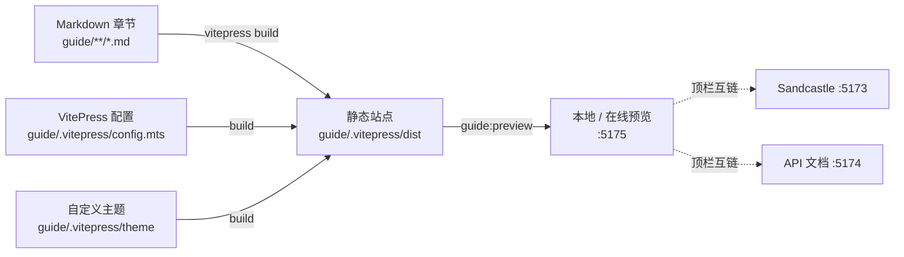

# 开发指南站

Feature Name: developer-guide
Updated: 2026-10-11
Status: Draft
References: `https://app.larkview.cn/sdk-docs/`、`.monkeycode/specs/2026-10-11-developer-guide/requirements.md`、`docs/architecture/11-api.md`、`docs/guides/sdk-development.md`

## 1. Description

本特性在 SDK 工程内新增**开发指南站**，面向 SDK 使用者，按任务与场景组织内容，形式对齐参考站 `https://app.larkview.cn/sdk-docs/`：顶栏导航、按类别分组的左侧边栏、正文代码示例、页内目录、上一页 / 下一页导航。指南与既有的 Sandcastle（即时预览）和 API 文档站（自动生成）共同构成完整文档体系。

关键决策（已确认）：

- 采用 **VitePress** 实现，与参考站同款。
- 内容 **全覆盖** SDK 能力，章节对齐 Sandcastle 示例主题。
- **独立端口**（默认 `5175`）预览，顶栏与 Sandcastle（`5173`）、API 文档（`5174`）互链。

## 2. Architecture

开发指南站是纯静态文档站点，位于仓库 `guide/` 目录，由 VitePress 构建。



## 3. Components and Interfaces

### 3.1 目录结构

```text
guide/
  .vitepress/
    config.mts            # 站点配置：标题、base、nav、sidebar、vite.allowedHosts
    theme/
      index.ts            # 继承默认主题
      PeerLinks.vue       # 顶栏兄弟站点链接（运行时时计算端口）
  index.md                # 首页（hero + features + 快速开始入口）
  intro/                  # 简介
  runtime/                # 运行时：创建 / 就绪 / 生命周期 / 错误
  camera/                 # 相机与导航
  scene/                  # 场景模式 / 时钟与环境 / 性能
  imagery-terrain/        # 底图 / 影像 / 地形
  layers/                 # 图层 / 3D Tiles
  data/                   # 数据目录 / 提供者
  graphics/               # 点 / 线 / 面 / 模型 / 样式
  interaction/            # 拾取 / 选择 / 事件
  analysis/               # 测量 / 地形 / 通视 / 查询 / 剖切 / 土方
  effects-ui/             # 材质与后处理 / UI 提示
  plugins/                # 插件系统
  migration/              # 从 Viewer 迁移
```

### 3.2 站点配置：`guide/.vitepress/config.mts`

要点：

- `base: "/"`（独立端口形态）。
- `vite.server.allowedHosts` 包含 `.monkeycode-ai.online`，满足在线预览域名。
- `themeConfig.nav`：首页 / 指南 / Sandcastle / API 文档；后两者使用可被运行时改写的占位链接。
- `themeConfig.sidebar`：按类别分组，章节顺序与内容结构一致。
- `themeConfig.outline: { level: [2, 3] }` 提供页内目录。
- 中文界面文案（`docFooter`、`outlineTitle`、`lastUpdated` 等）。

### 3.3 自定义主题与顶栏互链

`theme/index.ts` 继承 `vitepress/theme`，在 `nav-bar-content-after` 插槽挂载 `PeerLinks.vue`。`PeerLinks.vue` 在客户端按当前 `location.host` 计算兄弟端口地址：

- 本机（`localhost` / `127.*`）：`http://localhost:5173` 与 `http://localhost:5174`。
- 在线预览（形如 `5175-<suffix>.monkeycode-ai.online`）：替换端口前缀为 `5173-` / `5174-`。

这样在任意预览环境下顶栏均能指向正确的 Sandcastle 与 API 文档地址。

### 3.4 章节模板

每个章节保持统一结构：标题 → 一句话用途 → 基础示例（`ts` 代码块）→ 关键选项表 → 常见任务 → 相关 API 链接（指向 `api-docs` 或源代码）。

## 4. Data Model

指南内容以 Markdown 为唯一真源，不引入额外中间模型。站点构建产物与缓存目录被 git 忽略。

## 5. Error Handling

- 章节内代码示例保持可编译语义；不承诺在文档站中执行。
- 顶栏互链采用运行时降级：无法解析兄弟端口时链接回退到本机默认端口。
- `guide:build` 失败时 CI 终止，阻止损坏产物进入构件。

## 6. Testing Strategy

- 以「构建即校验」为主：`guide:build` 通过表示全部章节与配置可用。
- 链接完整性：构建阶段 VitePress 对内部链接进行校验（`ignoreDeadLinks: false`）。
- CI 新增 `guide` job：`npm ci` → `guide:build` → 上传 `guide-dist` 构件。

## 7. Deployment

指南产物为纯静态文件。本地与在线预览使用 `guide:preview`（端口 `5175`）。发布形态与 API 文档一致：CI 构件，不进入 npm 包。

## 8. Migration Plan

- 现有 `docs/guides/sdk-development.md` 定位为「工程内部迭代手册」，保留并更新其中的过时命令。
- 新增开发指南站定位为「使用者开发指南」，两者职责区分并在文档地图中标注。

## 9. Alternatives Considered

- **自研生成器复用 API 文档主题**：可控但需自建导航、搜索、目录与代码组，收益低。
- **单页 Markdown**：无法提供参考站的分组侧边栏与页内目录体验。
- 结论：采用 VitePress。
