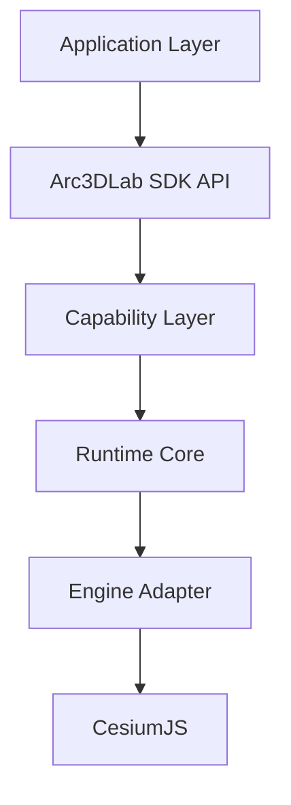

# Arc3DLab 产品定位与总体架构

Updated: 2026-10-08

## 定位

Arc3DLab 是面向三维 WebGIS 应用的模块化场景运行时 SDK。CesiumJS 是首个渲染引擎，SDK 架构本身独立于 Cesium 类型体系。

英文定位：

```text
Arc3DLab
A Modular 3D WebGIS Runtime
Built on CesiumJS
```

## 六层架构



- Application：Vue / React / Vanilla / Electron
- SDK API：`Arc3D.create` / `app.scene` / `app.layers` / `app.graphics`
- Capability：Analysis / Effects / Interaction / UI / Plugin
- Runtime Core：Context / Registry / EventBus / Lifecycle / Logger
- Engine Adapter：`@arc3dlab/engine-cesium`
- CesiumJS：Scene / Camera / Entity / Primitive / Tiles

## 根对象

```ts
const app = await Arc3D.create({ container: "map" })
```

开发者围绕以下命名空间工作：

- `app.scene` / `app.camera`
- `app.basemap` / `app.terrain` / `app.layers`
- `app.graphics` / `app.data`
- `app.interaction` / `app.analysis` / `app.effects` / `app.ui`
- `app.plugins` / `app.performance` / `app.logger` / `app.native`

## 包依赖

```text
core
  ^
engine-cesium
  ^
scene / layers / data / graphics
  ^
interaction / analysis / effects / ui
  ^
sdk
```

`core` 只依赖 TypeScript 标准库。Cesium 只允许出现在 `engine-cesium` 及其渲染后端。

源码边界：实现位于 `packages/*`，根目录 `src/index.ts` 只做对外再导出。
